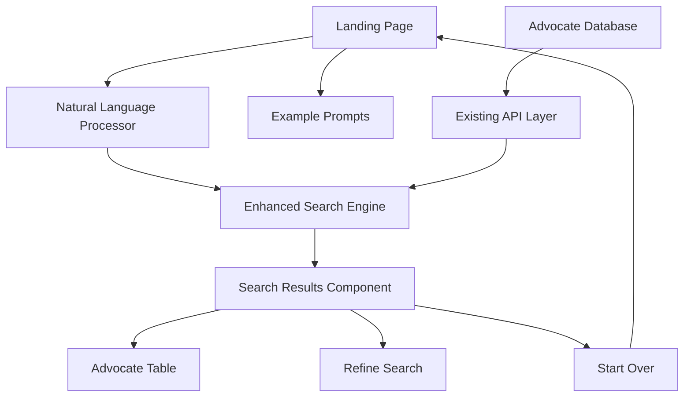
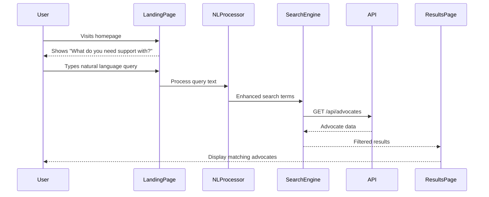
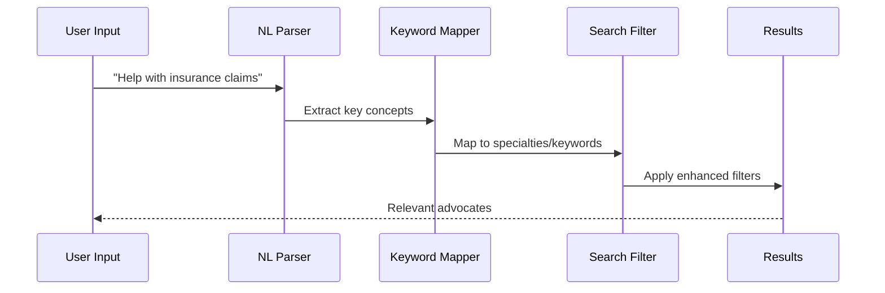

# Technical Design: Landing Page User Flow

## Overview

This design transforms the current advocate listing interface into a conversational, user-friendly landing page that guides users from describing their needs in natural language to finding relevant healthcare advocates. The solution maintains existing functionality while adding an intuitive entry point that reduces cognitive load for first-time users.

## Requirements Mapping

### Design Component Traceability
Each design component addresses specific requirements:
- **Landing Page Component** → REQ-1.1: Display welcoming question interface
- **Natural Language Search Engine** → REQ-1.2, REQ-1.3: Process free-form text and intelligent matching
- **Search Results Transition** → REQ-1.4: Seamless flow from input to results
- **Example Prompts Component** → REQ-1.5: Guided user input with suggestions
- **Navigation Components** → REQ-1.6, REQ-1.7: Maintain existing search + return to landing

### User Story Coverage
- **Story 1**: Landing page with conversational interface reduces intimidation factor
- **Story 2**: Enhanced search algorithm processes natural language queries
- **Story 3**: Progressive disclosure through guided flow from question to results

## Architecture

### High-level System Architecture



### Technology Stack
- **Frontend**: Next.js 14 with App Router + TypeScript (existing)
- **UI Components**: React functional components with hooks
- **Styling**: Tailwind CSS (existing)
- **Search Enhancement**: Client-side natural language processing
- **State Management**: React useState/useReducer for search flow
- **API Layer**: Existing /api/advocates endpoint (no changes needed)

### Architecture Decision Rationale

**Why Client-side NLP**: 
- Reduces server load and latency
- Enables real-time search suggestions
- Works with existing API without backend changes
- Progressive enhancement approach

**Why Progressive Disclosure**:
- Research shows staged interfaces reduce cognitive overload
- Maintains existing power-user functionality
- Improves conversion rates for new users

**Why Keyword Mapping Strategy**:
- More maintainable than ML-based solutions for this scale
- Provides predictable, debuggable results
- Can be enhanced with ML later without architectural changes

## Data Flow

### Primary User Flows



### Search Enhancement Flow



## Components and Interfaces

### Frontend Components

| Component | Responsibility | Props/State |
|-----------|---------------|-------------|
| LandingPage | Main entry point with question prompt | query: string, examples: string[] |
| ExamplePrompts | Display suggested queries | prompts: Prompt[], onSelect: (prompt) => void |
| NaturalLanguageSearch | Process and enhance user input | query: string, onResults: (results) => void |
| SearchResults | Display filtered advocates with refinement | advocates: Advocate[], originalQuery: string |
| SearchRefinement | Allow query modification | currentQuery: string, onRefine: (query) => void |

### Backend Services & Method Signatures

```typescript
// Enhanced search utilities (client-side)
class NaturalLanguageProcessor {
    processQuery(query: string): SearchTerms              // Extract keywords and intent
    mapToSpecialties(terms: SearchTerms): string[]        // Map to advocate specialties
    generateSearchFilters(query: string): SearchFilters   // Create filter criteria
}

class SearchEnhancer {
    enhanceAdvocateSearch(advocates: Advocate[], query: string): Advocate[]  // Apply NL search
    rankResults(advocates: Advocate[], query: string): Advocate[]            // Relevance scoring
    extractKeywords(query: string): string[]                                // Keyword extraction
}
```

### API Endpoints

Existing API endpoints remain unchanged - enhancement happens client-side:

| Method | Route | Purpose | Auth | Status Codes |
|--------|-------|---------|------|--------------|
| GET    | /api/advocates | List all advocates | None | 200, 500 |
| POST   | /api/seed | Seed database | None | 200, 500 |
| POST   | /api/seed-large | Seed large dataset | None | 200, 500 |

## Data Models

### Domain Entities
1. **SearchQuery**: User's natural language input with metadata
2. **SearchTerms**: Processed and extracted search concepts
3. **SearchFilters**: Applied filter criteria for advocate matching
4. **Prompt**: Example prompts to guide user input

### Enhanced Data Structures

```typescript
interface SearchQuery {
  id: string;
  originalText: string;
  processedTerms: string[];
  intent: SearchIntent;
  timestamp: Date;
}

interface SearchTerms {
  specialties: string[];
  keywords: string[];
  location?: string;
  experience?: number;
  confidence: number;
}

interface SearchFilters {
  specialtyMatches: string[];
  keywordMatches: string[];
  locationFilter?: string;
  experienceMin?: number;
  textSearch: string;
}

interface Prompt {
  id: string;
  text: string;
  category: 'insurance' | 'mental-health' | 'disability' | 'general';
  searchTerms: string[];
}

enum SearchIntent {
  FIND_SPECIALIST = 'find_specialist',
  INSURANCE_HELP = 'insurance_help',
  MENTAL_HEALTH = 'mental_health',
  DISABILITY_SUPPORT = 'disability_support',
  GENERAL_ADVOCACY = 'general_advocacy'
}
```

### Keyword Mapping Configuration

```typescript
const SPECIALTY_KEYWORDS = {
  'Mental Health': ['mental', 'therapy', 'counseling', 'depression', 'anxiety', 'psychiatric'],
  'Insurance Claims': ['insurance', 'claim', 'coverage', 'billing', 'reimbursement', 'payment'],
  'Disability Support': ['disability', 'accommodation', 'ADA', 'accessible', 'special needs'],
  'Chronic Disease': ['chronic', 'diabetes', 'cancer', 'heart disease', 'ongoing condition'],
  'Elderly Care': ['elderly', 'senior', 'aging', 'geriatric', 'medicare'],
  // ... expanded mapping
};

const INTENT_PATTERNS = {
  INSURANCE_HELP: /\b(insurance|claim|coverage|billing|reimbursement)\b/i,
  MENTAL_HEALTH: /\b(mental|therapy|counseling|depression|anxiety)\b/i,
  DISABILITY_SUPPORT: /\b(disability|accommodation|accessible)\b/i,
  // ... additional patterns
};
```

## User Experience Flow

### Landing Page Design

```typescript
// Landing page layout structure
<LandingPage>
  <HeroSection>
    <h1>Find Your Healthcare Advocate</h1>
    <h2>What do you need support with?</h2>
    <SearchInput placeholder="Describe your situation..." />
  </HeroSection>
  
  <ExamplePrompts>
    <Prompt>Help with insurance claims and denials</Prompt>
    <Prompt>Finding mental health support</Prompt>
    <Prompt>Disability accommodation assistance</Prompt>
    <Prompt>Navigate complex medical billing</Prompt>
  </ExamplePrompts>
  
  <QuickStats>
    <Stat>{advocateCount} Qualified Advocates</Stat>
    <Stat>{specialtyCount} Areas of Expertise</Stat>
  </QuickStats>
</LandingPage>
```

### Search Results Enhancement

```typescript
// Enhanced results display
<SearchResults>
  <SearchSummary>
    <p>Found {resultCount} advocates for "{originalQuery}"</p>
    <RefineButton onClick={handleRefine}>Refine Search</RefineButton>
    <StartOverButton onClick={handleStartOver}>Start New Search</StartOverButton>
  </SearchSummary>
  
  <ResultsList>
    {advocates.map(advocate => (
      <AdvocateCard 
        key={advocate.id}
        advocate={advocate}
        matchReasons={getMatchReasons(advocate, query)}
        relevanceScore={calculateRelevance(advocate, query)}
      />
    ))}
  </ResultsList>
</SearchResults>
```

## Natural Language Processing Implementation

### Keyword Extraction Algorithm

```typescript
class NaturalLanguageProcessor {
  processQuery(query: string): SearchTerms {
    // 1. Normalize input (lowercase, remove punctuation)
    const normalized = this.normalizeText(query);
    
    // 2. Extract keywords using predefined mappings
    const keywords = this.extractKeywords(normalized);
    
    // 3. Map to advocate specialties
    const specialties = this.mapToSpecialties(keywords);
    
    // 4. Detect intent patterns
    const intent = this.detectIntent(normalized);
    
    // 5. Calculate confidence score
    const confidence = this.calculateConfidence(keywords, specialties);
    
    return {
      specialties,
      keywords,
      intent,
      confidence
    };
  }
  
  private mapToSpecialties(keywords: string[]): string[] {
    const matches: string[] = [];
    
    Object.entries(SPECIALTY_KEYWORDS).forEach(([specialty, terms]) => {
      const hasMatch = terms.some(term => 
        keywords.some(keyword => keyword.includes(term))
      );
      if (hasMatch) matches.push(specialty);
    });
    
    return matches;
  }
}
```

### Search Enhancement Strategy

```typescript
class SearchEnhancer {
  enhanceAdvocateSearch(advocates: Advocate[], query: string): Advocate[] {
    const searchTerms = this.nlProcessor.processQuery(query);
    
    // Multi-tier matching strategy
    const exactMatches = this.findExactMatches(advocates, searchTerms);
    const partialMatches = this.findPartialMatches(advocates, searchTerms);
    const fallbackMatches = this.findFallbackMatches(advocates, query);
    
    // Combine and rank results
    const allMatches = [...exactMatches, ...partialMatches, ...fallbackMatches];
    const uniqueMatches = this.removeDuplicates(allMatches);
    
    return this.rankByRelevance(uniqueMatches, searchTerms);
  }
  
  private rankByRelevance(advocates: Advocate[], searchTerms: SearchTerms): Advocate[] {
    return advocates.sort((a, b) => {
      const scoreA = this.calculateRelevanceScore(a, searchTerms);
      const scoreB = this.calculateRelevanceScore(b, searchTerms);
      return scoreB - scoreA;
    });
  }
}
```

## Error Handling

### Search Error Scenarios

```typescript
interface SearchErrorHandler {
  handleNoResults(query: string): NoResultsResponse;
  handleSearchError(error: Error): ErrorResponse;
  suggestAlternatives(query: string): string[];
}

// No results found
<NoResultsState>
  <p>We couldn't find advocates matching "{query}"</p>
  <SuggestionsList>
    <li>Try broader terms like "insurance help" instead of specific claim types</li>
    <li>Check spelling and try alternative words</li>
    <li>Browse all advocates to see available specialties</li>
  </SuggestionsList>
  <ActionButtons>
    <Button onClick={showAllAdvocates}>Browse All Advocates</Button>
    <Button onClick={returnToLanding}>Start New Search</Button>
  </ActionButtons>
</NoResultsState>
```

## Performance & Scalability

### Performance Targets

| Metric | Target | Measurement |
|--------|--------|-------------|
| Landing Page Load | < 100ms | First Contentful Paint |
| Search Processing | < 50ms | Client-side NL processing |
| Results Display | < 200ms | Total search-to-results time |
| Keyword Mapping | < 10ms | Specialty mapping algorithm |

### Optimization Strategies

1. **Lazy Loading**: Load advocate data only after first search
2. **Memoization**: Cache processed search terms and mappings
3. **Progressive Enhancement**: Basic search works without JavaScript
4. **Debounced Search**: Prevent excessive API calls during typing

```typescript
// Performance optimizations
const SearchComponent = () => {
  const debouncedSearch = useMemo(
    () => debounce((query: string) => {
      const results = searchEnhancer.enhanceAdvocateSearch(advocates, query);
      setSearchResults(results);
    }, 300),
    [advocates]
  );
  
  const memoizedKeywordMap = useMemo(() => {
    return new Map(Object.entries(SPECIALTY_KEYWORDS));
  }, []);
};
```

## Testing Strategy

### Test Coverage Requirements
- **Unit Tests**: ≥90% coverage for NLP and search components
- **Integration Tests**: End-to-end user flows from landing to results
- **Usability Tests**: A/B testing of landing page variations

### Testing Approach

1. **Unit Testing - NLP Components**
```typescript
describe('NaturalLanguageProcessor', () => {
  it('should extract insurance-related keywords correctly', () => {
    const query = "I need help with my insurance claim denial";
    const result = processor.processQuery(query);
    expect(result.specialties).toContain('Insurance Claims');
    expect(result.intent).toBe(SearchIntent.INSURANCE_HELP);
  });
  
  it('should handle ambiguous queries gracefully', () => {
    const query = "I need support";
    const result = processor.processQuery(query);
    expect(result.confidence).toBeLessThan(0.5);
    expect(result.specialties.length).toBeGreaterThan(0);
  });
});
```

2. **Integration Testing - User Flows**
```typescript
describe('Landing Page to Results Flow', () => {
  it('should complete full search flow successfully', async () => {
    render(<App />);
    
    // User lands on homepage
    expect(screen.getByText(/what do you need support with/i)).toBeInTheDocument();
    
    // User enters query
    const input = screen.getByPlaceholderText(/describe your situation/i);
    fireEvent.change(input, { target: { value: 'mental health support' } });
    fireEvent.click(screen.getByRole('button', { name: /search/i }));
    
    // Results should appear
    await waitFor(() => {
      expect(screen.getByText(/found.*advocates/i)).toBeInTheDocument();
    });
  });
});
```

3. **Performance Testing**
```typescript
describe('Search Performance', () => {
  it('should process queries within performance targets', () => {
    const start = performance.now();
    const result = processor.processQuery(longComplexQuery);
    const duration = performance.now() - start;
    
    expect(duration).toBeLessThan(50); // 50ms target
    expect(result).toBeDefined();
  });
});
```

## Implementation Plan

### Phase 1: Core Landing Page (Week 1)
- Create landing page component with question prompt
- Implement basic text input and example prompts
- Add navigation to existing search results

### Phase 2: Natural Language Processing (Week 2)
- Implement keyword extraction and mapping
- Create specialty matching algorithm
- Add search intent detection

### Phase 3: Enhanced Search Results (Week 3)
- Integrate NLP with search functionality
- Add relevance scoring and ranking
- Implement search refinement and "start over" features

### Phase 4: Polish & Testing (Week 4)
- Add error handling and edge cases
- Implement performance optimizations
- Comprehensive testing and accessibility audit

## Migration Strategy

### Backward Compatibility
- Existing `/api/advocates` endpoint unchanged
- Current search functionality preserved as "Advanced Search"
- Direct URL access to advocate list maintained

### Feature Rollout
1. **Beta Users**: A/B test with 10% of traffic
2. **Gradual Rollout**: Increase to 50% after initial feedback
3. **Full Deployment**: 100% traffic after performance validation

This design provides a comprehensive technical blueprint for transforming the current advocate listing into a user-friendly, conversational interface while maintaining all existing functionality and ensuring optimal performance.