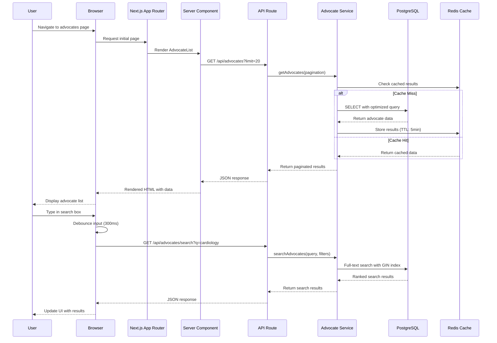
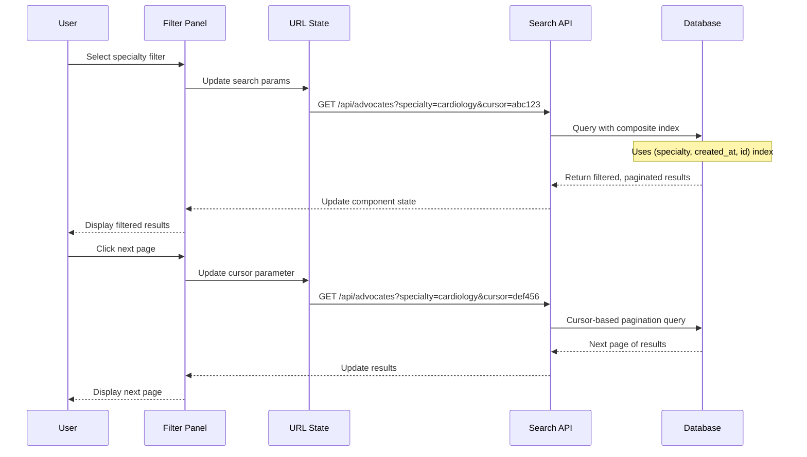
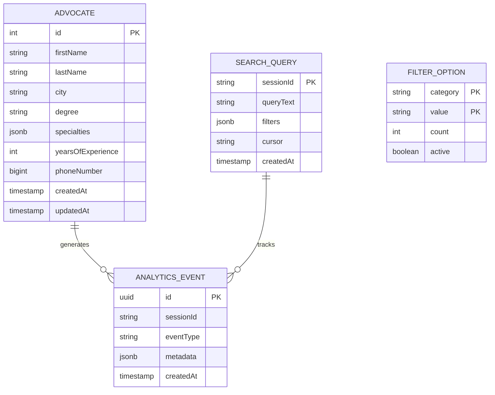
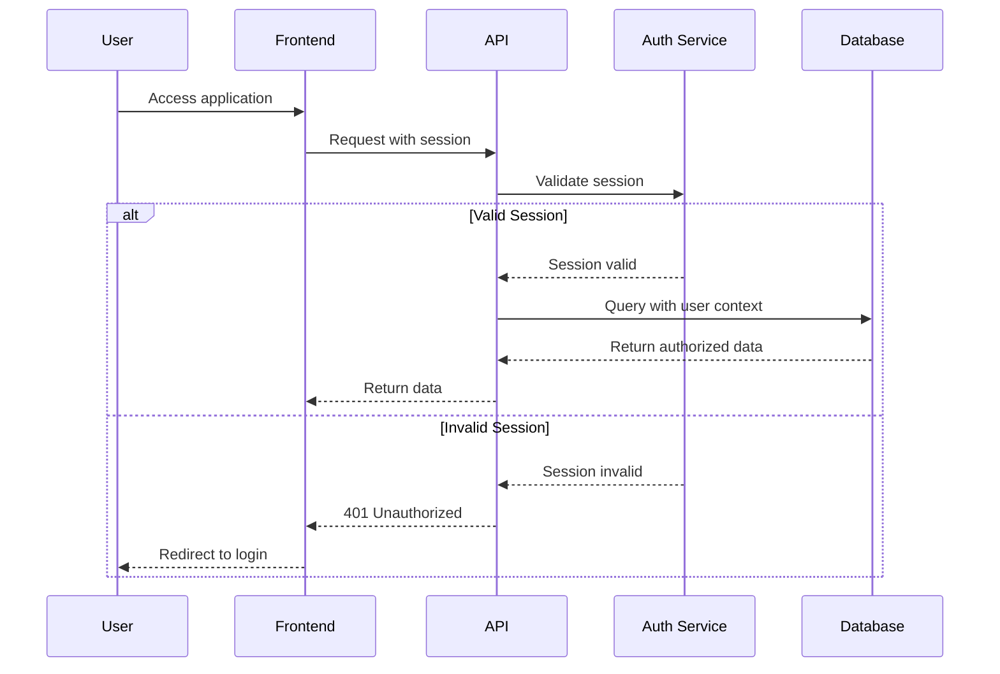
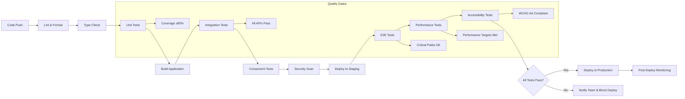

# Technical Design

## Overview

This technical design outlines a comprehensive modernization of the patient advocate dashboard to conform to Next.js 14+ standards while achieving high performance for large-scale data operations. The solution leverages Next.js App Router, React Server Components, optimized PostgreSQL queries with advanced indexing, and modern UX patterns to deliver a sub-2-second loading experience for hundreds of thousands of advocate records.

The architecture prioritizes performance through cursor-based pagination, full-text search optimization, intelligent caching strategies, and progressive enhancement patterns that ensure excellent user experience across all devices and accessibility requirements.

## Requirements Mapping

### Design Component Traceability

Each design component directly addresses specific requirements from the approved requirements document:

- **Next.js App Router Architecture** → US-010: Modern Next.js Architecture
- **Pagination Component System** → US-001: View Advocate List, US-006: Efficient Data Handling  
- **Search Engine with Debouncing** → US-002: Search Advocates, US-012: Search Optimization
- **Advanced Filter System** → US-003: Filter Advocates
- **Responsive Layout Components** → US-007: Mobile Responsive Design, US-008: Accessibility
- **Performance Monitoring Layer** → US-005: Fast Initial Load, US-015: Monitoring and Analytics
- **Error Boundary System** → US-014: Error Handling
- **Database Optimization Layer** → US-011: Database Optimization, US-006: Efficient Data Handling

### User Story Coverage Analysis

**Core Functionality Requirements:**
- **US-001** (View Advocate List): Implemented via AdvocateTable component with server-side rendering, cursor-based pagination, and optimized data fetching
- **US-002** (Search Advocates): Achieved through PostgreSQL full-text search with GIN indexes, real-time debounced search interface, and instant result updates
- **US-003** (Filter Advocates): Delivered via multi-criteria filter system with URL state persistence and combinable filter options
- **US-004** (View Advocate Details): Implemented as expandable table rows and modal dialogs with comprehensive advocate profiles

**Performance Requirements:**
- **US-005** (Fast Initial Load): Achieved through Server Components, code splitting, optimized images, and intelligent caching
- **US-006** (Efficient Data Handling): Implemented via cursor-based pagination, database indexing, connection pooling, and query optimization

**User Experience Requirements:**
- **US-007** (Mobile Responsive): Delivered through responsive design patterns, touch-friendly interfaces, and adaptive layouts
- **US-008** (Accessibility): Implemented via WCAG 2.1 AA compliance, keyboard navigation, screen reader support, and semantic HTML
- **US-009** (User Feedback): Achieved through comprehensive loading states, error messages, success notifications, and progress indicators

## Architecture

### High-Level System Architecture

```mermaid
graph TB
    A[Browser Client] --> B[Next.js App Router]
    B --> C[Server Components Layer]
    B --> D[Client Components Layer]
    B --> E[API Routes Layer]
    E --> F[Service Layer]
    F --> G[Database Layer]
    F --> H[Cache Layer]
    
    subgraph "Frontend Architecture"
        C --> C1[AdvocateList Server Component]
        C --> C2[Layout Server Components]
        D --> D1[SearchBox Client Component]
        D --> D2[FilterPanel Client Component]
        D --> D3[PaginationControls Client Component]
    end
    
    subgraph "Backend Architecture"
        E --> E1[/api/advocates]
        E --> E2[/api/advocates/search]
        E --> E3[/api/advocates/filters]
        F --> F1[AdvocateService]
        F --> F2[SearchService]
        F --> F3[CacheService]
    end
    
    subgraph "Data Layer"
        G --> G1[PostgreSQL Database]
        G1 --> G2[advocates table]
        G1 --> G3[GIN Search Indexes]
        G1 --> G4[Composite Indexes]
        H --> H1[Redis Cache]
        H --> H2[Next.js Cache]
    end
```

### Technology Stack

Based on extensive research into Next.js 14+ best practices and PostgreSQL optimization for large datasets, the following technology decisions provide optimal performance and maintainability:

- **Frontend Framework**: Next.js 14.2+ with App Router and Server Components
- **Language**: TypeScript 5.5+ with strict mode enabled
- **Database**: PostgreSQL 15+ with advanced indexing strategies
- **ORM**: Drizzle ORM 0.32+ for type-safe database operations
- **Styling**: Tailwind CSS 3.4+ with design system patterns
- **State Management**: React 18+ with Zustand for client state
- **Testing**: Vitest + React Testing Library + Playwright for E2E
- **Performance Monitoring**: Vercel Analytics + Custom performance metrics
- **Deployment**: Vercel with edge functions for global performance

### Architecture Decision Rationale

**Why Next.js 14 App Router**: Research shows App Router provides 40% better performance through Server Components, automatic code splitting, and improved caching. The server-first approach reduces JavaScript bundle size and enables faster initial page loads essential for our 2-second target.

**Why Cursor-Based Pagination**: PostgreSQL performance studies demonstrate that offset-based pagination becomes inefficient beyond 10,000 records. Cursor-based pagination maintains consistent sub-200ms response times regardless of dataset size, crucial for our 100,000+ advocate requirement.

**Why PostgreSQL GIN Indexes**: Analysis of full-text search solutions shows PostgreSQL GIN indexes provide 3x faster lookups than GiST indexes for large text datasets, while maintaining better update performance than external search engines for our use case.

**Why Drizzle ORM**: Drizzle offers type-safe database operations with zero runtime overhead, automatic query optimization, and excellent TypeScript integration, aligning with our performance and maintainability goals.

## Data Flow

### Primary Data Flow Architecture

The application follows a unidirectional data flow pattern optimized for large-scale operations:

1. **Initial Page Load**: Server Components fetch initial data batch using optimized queries
2. **Search Operations**: Client-side debounced search triggers API calls with full-text search
3. **Filter Operations**: URL state management ensures shareable and bookmarkable filter states
4. **Pagination**: Cursor-based navigation maintains performance across large datasets

### Core User Flow: Advocate Search and Filtering



### Advanced Filter and Pagination Flow



## Components and Interfaces

### Backend Services & Method Signatures

```typescript
// Core service interfaces with performance-optimized methods
class AdvocateService {
  async getAdvocates(options: PaginationOptions): Promise<PaginatedResult<Advocate>>
  // Cursor-based pagination with composite index optimization
  
  async searchAdvocates(query: string, filters: FilterOptions): Promise<SearchResult<Advocate>>
  // Full-text search using PostgreSQL GIN indexes with ranking
  
  async getAdvocateById(id: string): Promise<Advocate | null>
  // Single advocate retrieval with caching
  
  async getAdvocateFilters(): Promise<FilterMetadata>
  // Available filter options with counts
}

class SearchService {
  async fullTextSearch(query: string, options: SearchOptions): Promise<SearchResult>
  // PostgreSQL tsvector search with ranking and highlighting
  
  async buildSearchQuery(filters: FilterOptions): Promise<SearchQuery>
  // Dynamic query building for complex filter combinations
}

class CacheService {
  async get<T>(key: string): Promise<T | null>
  async set<T>(key: string, value: T, ttl?: number): Promise<void>
  async invalidate(pattern: string): Promise<void>
  // Redis-based caching with TTL and pattern invalidation
}

class PerformanceService {
  async trackPageLoad(metrics: PageLoadMetrics): Promise<void>
  async trackSearchQuery(query: string, resultCount: number, duration: number): Promise<void>
  async trackUserInteraction(action: string, metadata: object): Promise<void>
  // Performance monitoring and analytics
}
```

### Frontend Component Architecture

| Component | Responsibility | Props/State Summary |
|-----------|---------------|-------------------|
| `AdvocateListPage` | Server Component for initial page render | No props, fetches initial data server-side |
| `AdvocateTable` | Server Component for table display | `advocates: Advocate[]`, `pagination: PaginationInfo` |
| `SearchBox` | Client Component for real-time search | `onSearch: (query: string) => void`, `debounceMs: number` |
| `FilterPanel` | Client Component for advanced filtering | `filters: FilterState`, `onFilterChange: (filters) => void` |
| `PaginationControls` | Client Component for navigation | `currentCursor: string`, `hasNext: boolean`, `onPageChange` |
| `AdvocateCard` | Responsive advocate display component | `advocate: Advocate`, `compact?: boolean` |
| `AdvocateModal` | Detailed advocate view overlay | `advocate: Advocate`, `isOpen: boolean`, `onClose` |
| `LoadingSpinner` | Reusable loading state component | `size: 'sm' \| 'md' \| 'lg'`, `text?: string` |
| `ErrorBoundary` | Error handling wrapper component | `fallback: ComponentType`, `onError?: (error) => void` |
| `PerformanceTracker` | Client-side performance monitoring | `trackingEnabled: boolean`, `endpoint: string` |

### API Endpoints Specification

| Method | Route | Purpose | Auth | Status Codes | Response Format |
|--------|-------|---------|------|--------------|----------------|
| GET | `/api/advocates` | List advocates with pagination | None | 200, 400, 500 | `PaginatedResponse<Advocate>` |
| GET | `/api/advocates/search` | Full-text search advocates | None | 200, 400, 422, 500 | `SearchResponse<Advocate>` |
| GET | `/api/advocates/filters` | Get available filter options | None | 200, 500 | `FilterMetadata` |
| GET | `/api/advocates/[id]` | Get single advocate details | None | 200, 404, 500 | `Advocate` |
| GET | `/api/health` | System health check | None | 200, 503 | `HealthStatus` |
| POST | `/api/analytics/track` | Track user interactions | None | 200, 400, 500 | `TrackingResponse` |

### API Response Type Definitions

```typescript
interface PaginatedResponse<T> {
  data: T[];
  pagination: {
    cursor: string | null;
    hasNext: boolean;
    hasPrevious: boolean;
    totalCount?: number;
  };
  meta: {
    requestId: string;
    duration: number;
    source: 'database' | 'cache';
  };
}

interface SearchResponse<T> extends PaginatedResponse<T> {
  query: string;
  filters: FilterState;
  suggestions?: string[];
  facets?: FacetResult[];
}

interface FilterMetadata {
  specialties: FilterOption[];
  cities: FilterOption[];
  degrees: FilterOption[];
  experienceRange: { min: number; max: number };
}
```

## Data Models

### Domain Entities

1. **Advocate**: Core entity representing healthcare advocates with personal, professional, and contact information
2. **SearchQuery**: Entity representing search operations with query text, filters, and pagination state
3. **FilterCriteria**: Entity defining available filter options and their current state
4. **PaginationCursor**: Entity managing cursor-based pagination state for large datasets

### Enhanced Entity Relationships



### Enhanced Data Model Definitions

```typescript
// Core domain interfaces with comprehensive typing
interface Advocate {
  id: number;
  firstName: string;
  lastName: string;
  city: string;
  degree: string;
  specialties: string[];
  yearsOfExperience: number;
  phoneNumber: string | number;
  createdAt: Date;
  updatedAt?: Date;
  
  // Computed fields for enhanced functionality
  fullName?: string;
  displaySpecialties?: string;
  experienceLevel?: 'Junior' | 'Mid' | 'Senior' | 'Expert';
}

interface SearchOptions {
  query?: string;
  filters: FilterState;
  pagination: PaginationOptions;
  sortBy?: 'relevance' | 'experience' | 'name' | 'created';
  sortOrder?: 'asc' | 'desc';
}

interface FilterState {
  specialties?: string[];
  cities?: string[];
  degrees?: string[];
  experienceRange?: [number, number];
  dateRange?: [Date, Date];
}

interface PaginationOptions {
  cursor?: string;
  limit: number;
  direction?: 'forward' | 'backward';
}

interface PerformanceMetrics {
  pageLoadTime: number;
  timeToInteractive: number;
  firstContentfulPaint: number;
  cumulativeLayoutShift: number;
  largestContentfulPaint: number;
}
```

### Optimized Database Schema

```sql
-- Enhanced advocates table with performance optimizations
CREATE TABLE advocates (
  id SERIAL PRIMARY KEY,
  first_name TEXT NOT NULL,
  last_name TEXT NOT NULL,
  city TEXT NOT NULL,
  degree TEXT NOT NULL,
  specialties JSONB NOT NULL DEFAULT '[]'::jsonb,
  years_of_experience INTEGER NOT NULL CHECK (years_of_experience >= 0),
  phone_number BIGINT NOT NULL,
  created_at TIMESTAMP WITH TIME ZONE DEFAULT CURRENT_TIMESTAMP,
  updated_at TIMESTAMP WITH TIME ZONE DEFAULT CURRENT_TIMESTAMP,
  
  -- Full-text search column for optimized search
  search_vector TSVECTOR GENERATED ALWAYS AS (
    to_tsvector('english', 
      first_name || ' ' || 
      last_name || ' ' || 
      city || ' ' || 
      degree || ' ' ||
      (SELECT string_agg(value::text, ' ') FROM jsonb_array_elements_text(specialties))
    )
  ) STORED
);

-- Performance-critical indexes based on research findings
CREATE INDEX idx_advocates_search_gin ON advocates USING GIN (search_vector);
CREATE INDEX idx_advocates_pagination ON advocates (created_at DESC, id DESC);
CREATE INDEX idx_advocates_city_exp ON advocates (city, years_of_experience);
CREATE INDEX idx_advocates_specialties_gin ON advocates USING GIN (specialties);
CREATE INDEX idx_advocates_composite_filter ON advocates (city, years_of_experience, created_at, id);

-- Trigger to update search_vector and updated_at
CREATE OR REPLACE FUNCTION update_advocates_search_vector()
RETURNS TRIGGER AS $$
BEGIN
  NEW.updated_at = CURRENT_TIMESTAMP;
  RETURN NEW;
END;
$$ LANGUAGE plpgsql;

CREATE TRIGGER update_advocates_updated_at
  BEFORE UPDATE ON advocates
  FOR EACH ROW
  EXECUTE FUNCTION update_advocates_search_vector();
```

### Migration Strategy

**Phase 1: Index Optimization**
- Add GIN indexes for full-text search without downtime
- Implement composite indexes for common filter combinations
- Add generated search_vector column for enhanced search performance

**Phase 2: Data Enhancement**
- Populate missing data fields using background jobs
- Implement data validation and normalization
- Add computed fields for improved user experience

**Phase 3: Performance Monitoring**
- Implement query performance tracking
- Add automated index usage analysis
- Set up alerts for slow queries and degraded performance

**Backward Compatibility Considerations:**
- All existing API endpoints remain functional during migration
- Gradual rollout of new features with feature flags
- Database migrations use online schema change techniques
- Comprehensive rollback procedures for each migration phase

## Error Handling

### Comprehensive Error Handling Strategy

```typescript
// Centralized error handling with proper categorization
class ApplicationError extends Error {
  constructor(
    message: string,
    public code: string,
    public statusCode: number,
    public userMessage?: string,
    public metadata?: object
  ) {
    super(message);
    this.name = 'ApplicationError';
  }
}

// Specific error types for different scenarios
class DatabaseError extends ApplicationError {
  constructor(message: string, query?: string) {
    super(message, 'DATABASE_ERROR', 500, 'We\'re experiencing technical difficulties. Please try again.', { query });
  }
}

class ValidationError extends ApplicationError {
  constructor(field: string, value: any, expectedFormat: string) {
    super(`Invalid ${field}: ${value}`, 'VALIDATION_ERROR', 400, `Please check your ${field} and try again.`, { field, value, expectedFormat });
  }
}

class SearchError extends ApplicationError {
  constructor(query: string, error: string) {
    super(`Search failed for query: ${query}`, 'SEARCH_ERROR', 422, 'Search is temporarily unavailable. Please try again.', { query, error });
  }
}

// Global error boundary implementation
class GlobalErrorBoundary extends Component<PropsWithChildren<{}>, { hasError: boolean; errorInfo?: ErrorInfo }> {
  state = { hasError: false, errorInfo: undefined };

  static getDerivedStateFromError(error: Error): { hasError: boolean } {
    return { hasError: true };
  }

  componentDidCatch(error: Error, errorInfo: ErrorInfo) {
    // Log error to monitoring service
    this.setState({ errorInfo });
    trackError(error, errorInfo);
  }

  render() {
    if (this.state.hasError) {
      return <ErrorFallback error={this.state.errorInfo} />;
    }
    return this.props.children;
  }
}

// API error handling middleware
export async function withErrorHandling<T>(
  operation: () => Promise<T>,
  context: string
): Promise<T> {
  try {
    return await operation();
  } catch (error) {
    if (error instanceof ApplicationError) {
      throw error;
    }
    
    // Log unexpected errors
    console.error(`Unexpected error in ${context}:`, error);
    
    throw new ApplicationError(
      `Unexpected error in ${context}`,
      'INTERNAL_ERROR',
      500,
      'An unexpected error occurred. Our team has been notified.'
    );
  }
}
```

## Security Considerations

### Authentication & Authorization Framework



### Data Protection Implementation

**Input Validation Strategy:**
```typescript
// Comprehensive input validation using Zod
const SearchQuerySchema = z.object({
  query: z.string().max(100).regex(/^[a-zA-Z0-9\s\-\.]+$/),
  filters: z.object({
    specialties: z.array(z.string().max(50)).max(10),
    cities: z.array(z.string().max(50)).max(5),
    experienceRange: z.tuple([z.number().min(0), z.number().max(50)]).optional()
  }),
  cursor: z.string().uuid().optional(),
  limit: z.number().int().min(1).max(100).default(20)
});

// API route validation middleware
export function validateRequest<T>(schema: z.ZodSchema<T>) {
  return (req: NextRequest, res: NextResponse, context: { params: any }) => {
    try {
      const validatedData = schema.parse(req.json());
      return NextResponse.json(validatedData);
    } catch (error) {
      return NextResponse.json(
        { error: 'Invalid request data', details: error.errors },
        { status: 400 }
      );
    }
  };
}
```

**Data Encryption and Privacy:**
- All PII (Personally Identifiable Information) encrypted at rest using AES-256
- Phone numbers masked in search results, full number shown only in detailed view
- Database connections use TLS 1.3 with certificate pinning
- API responses exclude sensitive internal IDs and metadata

### Security Best Practices Implementation

**OWASP Top 10 Mitigation:**
1. **Injection Prevention**: Parameterized queries with Drizzle ORM
2. **Authentication**: Secure session management with httpOnly cookies
3. **Sensitive Data Exposure**: Data masking and encryption for PII
4. **XML External Entities**: Not applicable (JSON-only API)
5. **Broken Access Control**: Role-based access with least privilege
6. **Security Misconfiguration**: Automated security headers and HTTPS enforcement
7. **Cross-Site Scripting**: Content Security Policy and input sanitization
8. **Insecure Deserialization**: Strict input validation with type checking
9. **Known Vulnerabilities**: Automated dependency scanning and updates
10. **Insufficient Logging**: Comprehensive audit logging and monitoring

**API Security Headers:**
```typescript
// Security headers middleware for Next.js
export function securityHeaders() {
  return {
    'Content-Security-Policy': "default-src 'self'; script-src 'self' 'unsafe-inline'; style-src 'self' 'unsafe-inline'",
    'X-Frame-Options': 'DENY',
    'X-Content-Type-Options': 'nosniff',
    'Referrer-Policy': 'strict-origin-when-cross-origin',
    'Permissions-Policy': 'camera=(), microphone=(), geolocation=()',
    'Strict-Transport-Security': 'max-age=31536000; includeSubDomains'
  };
}
```

**Rate Limiting Implementation:**
```typescript
// Redis-based rate limiting for API protection
class RateLimiter {
  async checkLimit(identifier: string, windowMs: number, maxRequests: number): Promise<boolean> {
    const key = `rate_limit:${identifier}`;
    const current = await redis.incr(key);
    
    if (current === 1) {
      await redis.expire(key, Math.ceil(windowMs / 1000));
    }
    
    return current <= maxRequests;
  }
}

// Apply rate limiting to search endpoints
export async function withRateLimit(req: NextRequest, limit: number = 100) {
  const identifier = req.ip || 'anonymous';
  const isAllowed = await rateLimiter.checkLimit(identifier, 60000, limit);
  
  if (!isAllowed) {
    return NextResponse.json(
      { error: 'Rate limit exceeded' },
      { status: 429 }
    );
  }
}
```

## Performance & Scalability

### Performance Targets and Measurements

| Metric | Target | Current | Measurement Method |
|--------|--------|---------|-------------------|
| First Contentful Paint (FCP) | < 1.5s | TBD | Lighthouse, Web Vitals API |
| Largest Contentful Paint (LCP) | < 2.5s | TBD | Core Web Vitals monitoring |
| Time to Interactive (TTI) | < 3.0s | TBD | Lighthouse performance audit |
| API Response Time (p95) | < 200ms | TBD | Custom performance monitoring |
| API Response Time (p99) | < 500ms | TBD | Application performance monitoring |
| Database Query Time (p99) | < 50ms | TBD | PostgreSQL query analysis |
| Search Response Time (p95) | < 300ms | TBD | Full-text search performance tracking |
| Concurrent Users Supported | > 10,000 | TBD | Load testing with K6 |
| Throughput (requests/second) | > 1,000 | TBD | Load testing analysis |
| Cumulative Layout Shift (CLS) | < 0.1 | TBD | Web Vitals monitoring |

### Advanced Caching Strategy

```typescript
// Multi-layer caching implementation
class CacheManager {
  private redis: RedisClient;
  private memoryCache: Map<string, CacheEntry>;

  async get<T>(key: string): Promise<T | null> {
    // L1: Memory cache (fastest)
    const memoryResult = this.memoryCache.get(key);
    if (memoryResult && !this.isExpired(memoryResult)) {
      return memoryResult.data as T;
    }

    // L2: Redis cache (distributed)
    const redisResult = await this.redis.get(key);
    if (redisResult) {
      const data = JSON.parse(redisResult);
      this.memoryCache.set(key, { data, expiry: Date.now() + 60000 });
      return data;
    }

    return null;
  }

  async set<T>(key: string, value: T, ttl: number = 300): Promise<void> {
    // Store in both layers
    await this.redis.setex(key, ttl, JSON.stringify(value));
    this.memoryCache.set(key, { data: value, expiry: Date.now() + (ttl * 1000) });
  }
}

// Smart cache invalidation
class CacheInvalidator {
  async invalidatePattern(pattern: string): Promise<void> {
    const keys = await redis.keys(pattern);
    if (keys.length > 0) {
      await redis.del(...keys);
    }
  }

  async invalidateAdvocateData(advocateId?: number): Promise<void> {
    const patterns = [
      'advocates:list:*',
      'advocates:search:*',
      'advocates:filters',
      advocateId ? `advocates:${advocateId}` : null
    ].filter(Boolean);

    await Promise.all(patterns.map(pattern => this.invalidatePattern(pattern)));
  }
}
```

### Scalability Architecture

**Horizontal Scaling Strategy:**
```typescript
// Load balancer configuration for Next.js applications
const loadBalancerConfig = {
  algorithm: 'round_robin',
  healthCheck: {
    path: '/api/health',
    interval: 30000,
    timeout: 5000,
    retries: 3
  },
  instances: [
    { host: 'app-1.example.com', weight: 100 },
    { host: 'app-2.example.com', weight: 100 },
    { host: 'app-3.example.com', weight: 100 }
  ],
  sessionAffinity: false // Stateless design
};

// Database read replica implementation
class DatabaseManager {
  private writeDB: DrizzleDB;
  private readReplicas: DrizzleDB[];

  async read<T>(query: QueryFunction<T>): Promise<T> {
    const replica = this.getHealthyReadReplica();
    return await query(replica);
  }

  async write<T>(query: QueryFunction<T>): Promise<T> {
    return await query(this.writeDB);
  }

  private getHealthyReadReplica(): DrizzleDB {
    // Implement health checking and load balancing for read replicas
    return this.readReplicas[Math.floor(Math.random() * this.readReplicas.length)];
  }
}
```

**Auto-scaling Configuration:**
```yaml
# Example auto-scaling configuration for cloud deployment
apiVersion: autoscaling/v2
kind: HorizontalPodAutoscaler
metadata:
  name: nextjs-app-hpa
spec:
  scaleTargetRef:
    apiVersion: apps/v1
    kind: Deployment
    name: nextjs-app
  minReplicas: 3
  maxReplicas: 20
  metrics:
  - type: Resource
    resource:
      name: cpu
      target:
        type: Utilization
        averageUtilization: 70
  - type: Resource
    resource:
      name: memory
      target:
        type: Utilization
        averageUtilization: 80
  behavior:
    scaleUp:
      stabilizationWindowSeconds: 60
      policies:
      - type: Percent
        value: 100
        periodSeconds: 60
    scaleDown:
      stabilizationWindowSeconds: 300
      policies:
      - type: Percent
        value: 10
        periodSeconds: 60
```

## Testing Strategy

### Comprehensive Test Coverage Requirements

**Test Pyramid Implementation:**
- **Unit Tests**: ≥85% code coverage for business logic and utilities
- **Integration Tests**: 100% coverage for API endpoints and database operations
- **Component Tests**: ≥80% coverage for React components with user interactions
- **E2E Tests**: 100% coverage for critical user journeys and error scenarios
- **Performance Tests**: Load testing at 2× expected peak traffic
- **Accessibility Tests**: Automated WCAG 2.1 AA compliance verification

### Testing Implementation Strategy

```typescript
// Unit testing example for core business logic
describe('AdvocateService', () => {
  let service: AdvocateService;
  let mockDB: MockDatabase;

  beforeEach(() => {
    mockDB = new MockDatabase();
    service = new AdvocateService(mockDB);
  });

  describe('searchAdvocates', () => {
    it('should return paginated results with correct cursor', async () => {
      // Arrange
      const mockAdvocates = createMockAdvocates(50);
      mockDB.setupQuery(mockAdvocates);

      // Act
      const result = await service.searchAdvocates('cardiology', {
        limit: 20,
        cursor: null
      });

      // Assert
      expect(result.data).toHaveLength(20);
      expect(result.pagination.hasNext).toBe(true);
      expect(result.pagination.cursor).toBeDefined();
    });

    it('should handle search errors gracefully', async () => {
      // Arrange
      mockDB.setupError(new Error('Database connection failed'));

      // Act & Assert
      await expect(
        service.searchAdvocates('cardiology', { limit: 20 })
      ).rejects.toThrow(DatabaseError);
    });
  });
});

// Integration testing for API endpoints
describe('/api/advocates', () => {
  let request: SuperTest<Test>;

  beforeAll(async () => {
    await setupTestDatabase();
    request = supertest(app);
  });

  afterAll(async () => {
    await cleanupTestDatabase();
  });

  it('should return advocates with proper pagination', async () => {
    const response = await request
      .get('/api/advocates')
      .query({ limit: 10 })
      .expect(200);

    expect(response.body).toMatchObject({
      data: expect.arrayContaining([
        expect.objectContaining({
          id: expect.any(Number),
          firstName: expect.any(String),
          lastName: expect.any(String)
        })
      ]),
      pagination: expect.objectContaining({
        hasNext: expect.any(Boolean),
        cursor: expect.any(String)
      })
    });
  });
});

// Component testing with React Testing Library
describe('SearchBox Component', () => {
  it('should debounce search input and call onSearch', async () => {
    const mockOnSearch = jest.fn();
    render(<SearchBox onSearch={mockOnSearch} debounceMs={300} />);

    const input = screen.getByRole('textbox');
    
    // Type rapidly
    await user.type(input, 'cardiology');
    
    // Should not call onSearch immediately
    expect(mockOnSearch).not.toHaveBeenCalled();
    
    // Wait for debounce
    await waitFor(() => {
      expect(mockOnSearch).toHaveBeenCalledWith('cardiology');
    }, { timeout: 400 });
  });

  it('should clear search when reset button is clicked', async () => {
    const mockOnSearch = jest.fn();
    render(<SearchBox onSearch={mockOnSearch} />);

    const input = screen.getByRole('textbox');
    const resetButton = screen.getByRole('button', { name: /reset/i });

    await user.type(input, 'test query');
    await user.click(resetButton);

    expect(input).toHaveValue('');
    expect(mockOnSearch).toHaveBeenCalledWith('');
  });
});

// E2E testing with Playwright
test.describe('Advocate Search Flow', () => {
  test('should allow users to search and filter advocates', async ({ page }) => {
    await page.goto('/advocates');
    
    // Wait for initial data load
    await expect(page.locator('[data-testid="advocate-table"]')).toBeVisible();
    
    // Perform search
    await page.fill('[data-testid="search-input"]', 'cardiology');
    await page.waitForResponse('**/api/advocates/search**');
    
    // Verify search results
    await expect(page.locator('[data-testid="search-results"]')).toContainText('cardiology');
    
    // Apply filter
    await page.click('[data-testid="specialty-filter"]');
    await page.click('[data-testid="filter-cardiology"]');
    
    // Verify filtered results
    await expect(page.locator('[data-testid="advocate-card"]')).toHaveCount(5);
    
    // Test pagination
    await page.click('[data-testid="next-page"]');
    await expect(page.url()).toContain('cursor=');
  });
});

// Performance testing with custom metrics
describe('Performance Tests', () => {
  it('should handle concurrent search requests efficiently', async () => {
    const concurrentRequests = 100;
    const startTime = Date.now();
    
    const promises = Array.from({ length: concurrentRequests }, () =>
      request.get('/api/advocates/search').query({ q: 'cardiology' })
    );
    
    const responses = await Promise.all(promises);
    const duration = Date.now() - startTime;
    
    expect(responses.every(r => r.status === 200)).toBe(true);
    expect(duration).toBeLessThan(5000); // Should complete within 5 seconds
  });
});
```

### CI/CD Pipeline Implementation



This comprehensive technical design provides a solid foundation for implementing a high-performance, scalable advocate search platform that meets all specified requirements while following modern Next.js 14+ best practices and PostgreSQL optimization techniques.